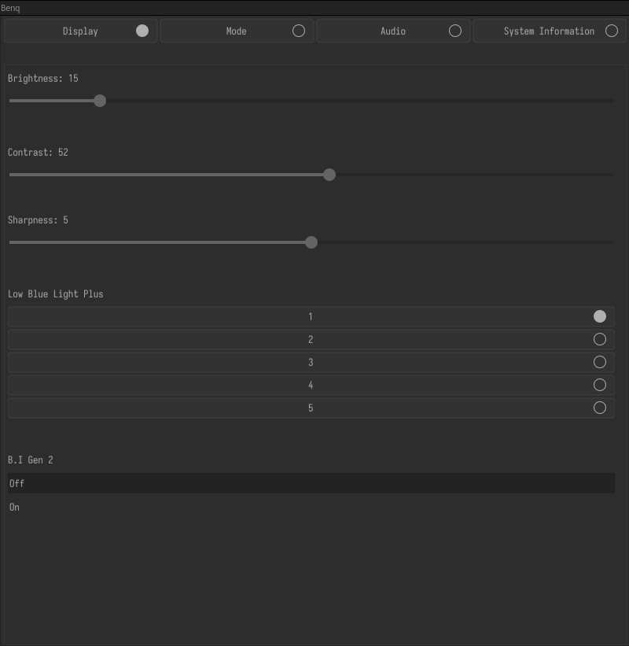
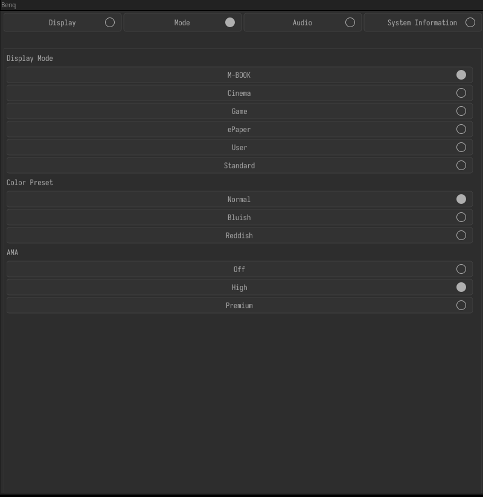
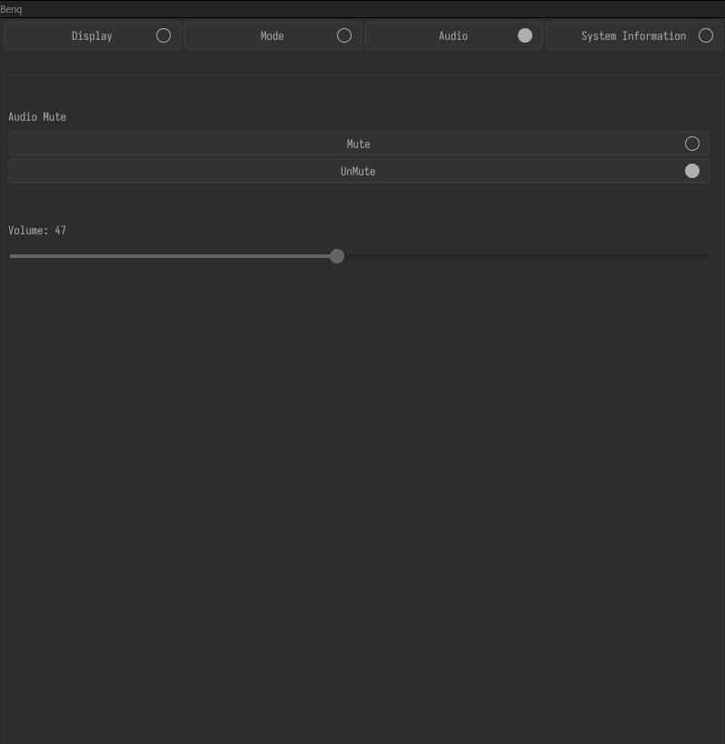
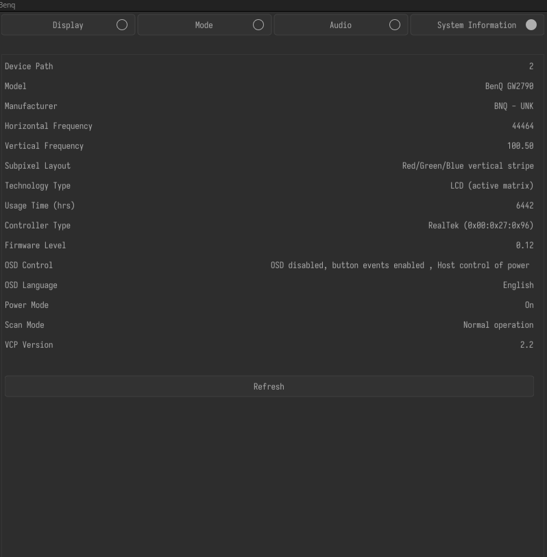

# BenQ GW2790

A Linux GUI for controlling the **BenQ GW2790** monitor over **DDC/CI**.

Written in **C3**, the application uses **Nuklear**, **SDL2**, **OpenGL**, and **GLEW** to provide a simple interface for changing monitor settings without having to wrestle with the monitor's OSD (I'm just lazy).

## Features

### Display

- Brightness
- Contrast
- Sharpness
- Low Blue Light Plus
- B.I. Gen2

### Display Mode

Switch between the monitor's built-in display modes:

- Standard
- User
- Cinema
- Game
- ePaper
- M-Book

### Color Presets

- Normal
- Bluish
- Reddish

### AMA (Advanced Motion Accelerator)

- Off
- High
- Premium

### Audio

- Volume control
- Mute / Unmute

### System Information

View monitor information reported through DDC/CI.

## Screenshots

### Display



### Display Modes



### Audio



### System Information



# Installation 
 - Download binary from [link](https://github.com/vamsi200/benq-gw2790/releases/)
 - Make it executable:
     - ```bash
       chmod +x Benq-x86_64.AppImage
       ```
  - Run it:
      ```bash
      ./Benq-x86_64.AppImage
      ```
      
# Building from source
## Dependencies

You need the following:

- C3 compiler
- GCC
- SDL2 development package
- GLEW development package
- OpenGL development files

### Arch Linux

```sh
sudo pacman -S gcc sdl2 glew
```

### Ubuntu / Debian

```sh
sudo apt install build-essential libsdl2-dev libglew-dev
```

## Building
  
First, install the C3 compiler:

https://github.com/c3lang/c3c

Clone the repository:

```sh
git clone https://github.com/vamsi200/benq-gw2790
cd benq-gw2790
```

Build the project:

```sh
./src/build.sh
```

Manually:

Compile the Nuklear backend:

```sh
cd src
gcc -c nuklear.c -o nuklear.o -I. $(sdl2-config --cflags)
cd ..
```

Build the application:

```sh
c3c build -l SDL2 -l GL -l GLEW -z src/nuklear.o
```

The executable will be in the `build/` directory.


## Notes

This project is currently designed just for the **BenQ GW2790**. While other BenQ monitors may expose similar DDC/CI VCP codes, compatibility with other models has not yet been tested/verified.

## License

MIT
